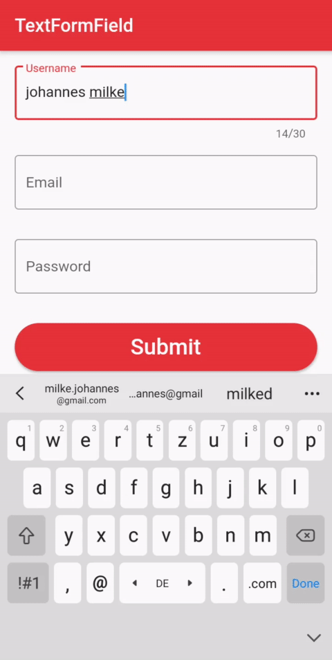

# Flutter Tutorial - How To Use Form and TextFormField

    

### ✌&ensp;Preview

|              App Preview             |             Course Preview           |
| :----------------------------------: | :----------------------------------: |
|  |  |

➜&ensp;[Buy My Courses](https://johannesmilke.teachable.com/p/home "Buy My Courses")

### 📺&ensp;Watch Video

##### [YouTube video](https://www.youtube.com/watch?v=2rn3XbBijy4 "Youtube Johannes Milke") where the *source code* is explained. [Subscribe YouTube channel.](http://www.youtube.com/channel/UC0FD2apauvegCcsvqIBceLA?sub_confirmation=1 "YouTube Subscribe Johannes Milke")  

[twitter]: https://twitter.com/intent/follow?original_referer=https%3A%2F%2Fgithub.com%2FJohannesMilke&screen_name=JohannesMilke
[youtube]: https://www.youtube.com/channel/UC0FD2apauvegCcsvqIBceLA?sub_confirmation=1
[courses]: https://johannesmilke.teachable.com/p/home
